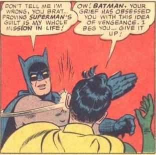

# BATSLAP

I created this library so that I could easily generate and embed original
versions of the "my parents are dead" meme on
[comicreleases.com](http://comicreleases.com).

The original image comes from a panel in World's Finest #153

The meme came from the interwebs in 2008:

Take a look at the [demo](http://curlee.github.io/batslap/demo/) for example
usage.

Bower support is right around the corner, until then you can [download](https://raw.githubusercontent.com/curlee/batslap/master/dist/batslap.min.js) the library.